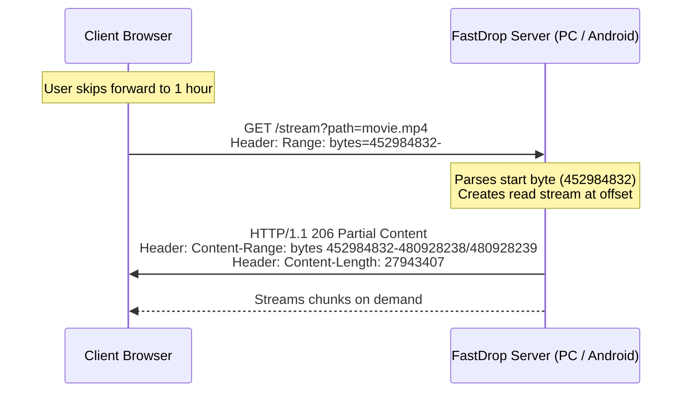

<p align="center">
  <svg width="400" height="150" viewBox="0 0 400 150" fill="none" xmlns="http://www.w3.org/2000/svg">
    <!-- Definitions for gradients and glow -->
    <defs>
      <linearGradient id="gold-grad" x1="0%" y1="0%" x2="100%" y2="100%">
        <stop offset="0%" stop-color="#ffe082" />
        <stop offset="50%" stop-color="#d4af37" />
        <stop offset="100%" stop-color="#b8860b" />
      </linearGradient>
      <filter id="glow" x="-20%" y="-20%" width="140%" height="140%">
        <feGaussianBlur stdDeviation="6" result="blur" />
        <feComposite in="SourceGraphic" in2="blur" operator="over" />
      </filter>
    </defs>
    
    <!-- Background card -->
    <rect width="100%" height="100%" rx="16" fill="#0d0f14" />
    <rect width="100%" height="100%" rx="16" stroke="url(#gold-grad)" stroke-width="1.5" stroke-opacity="0.3" />
    
    <!-- Glowing backing blur -->
    <circle cx="200" cy="75" r="40" fill="#d4af37" fill-opacity="0.08" filter="url(#glow)" />
    
    <!-- Television & Lightning Logo -->
    <g transform="translate(55, 38)">
      <!-- TV Screen Outline -->
      <rect x="0" y="0" width="85" height="58" rx="8" stroke="url(#gold-grad)" stroke-width="2.5" fill="#141822" />
      <!-- TV Legs/Stand -->
      <line x1="28" y1="58" x2="18" y2="74" stroke="url(#gold-grad)" stroke-width="3" stroke-linecap="round" />
      <line x1="57" y1="58" x2="67" y2="74" stroke="url(#gold-grad)" stroke-width="3" stroke-linecap="round" />
      <line x1="18" y1="74" x2="67" y2="74" stroke="url(#gold-grad)" stroke-width="3" stroke-linecap="round" />
      <!-- Lightning Bolt inside screen -->
      <path d="M45 14 L32 30 L41 30 L37 46 L53 26 L42 26 Z" fill="url(#gold-grad)" filter="url(#glow)" />
    </g>
    
    <!-- Brand Title -->
    <text x="165" y="70" fill="#fffdf5" font-family="-apple-system, BlinkMacSystemFont, 'Segoe UI', Roboto, sans-serif" font-size="28" font-weight="900" letter-spacing="1">FASTDROP TV</text>
    <text x="165" y="92" fill="#c7b897" font-family="-apple-system, BlinkMacSystemFont, 'Segoe UI', Roboto, sans-serif" font-size="11" font-weight="700" letter-spacing="1.5">PREMIUM MEDIA STREAMER</text>
  </svg>
</p>

<p align="center">
  
  
  
</p>

---

**FastDrop TV** is an ultra-fast, local network file streaming application built specifically for Samsung Tizen TVs, but **fully optimized for all modern web browsers**. 

It turns your Android phone or laptop into a powerful media server, allowing you to stream videos, music, photos, and document files directly to any TV screen, PC, tablet, or mobile device on your local network.

---

## ⚡ Premium Features

<table width="100%">
  <tr>
    <td width="50%">
      <h3>🎬 Offline Movie Posters</h3>
      <p>Scans folders for video files and matching images (e.g., <code>Inception.mp4</code> and <code>Inception.jpg</code>) and displays them as grid posters. Image cover files are automatically hidden to keep directory views clean.</p>
    </td>
    <td width="50%">
      <h3>🎵 Background Play & Mini-Player</h3>
      <p>Exit the audio screen and the music keeps playing! A floating gold glassmorphic mini-player bar displays at the bottom-right of the screen with a progress fill. Press <b>BACK</b> to maximize.</p>
    </td>
  </tr>
  <tr>
    <td width="50%">
      <h3>🔀 Shuffle & Repeat Playback</h3>
      <p>Full-featured controls on the audio screen let you toggle <b>Shuffle</b> mode and cycle <b>Repeat</b> settings (Repeat One, Repeat All, Repeat Off) for seamless, hands-free playlists.</p>
    </td>
    <td width="50%">
      <h3>📄 Lag-Free PDF Viewer</h3>
      <p>Reads PDF documents directly inside your media grid. Uses a 100% offline, locally bundled build of PDF.js that renders page-by-page on canvas with strict memory garbage collection (<code>page.cleanup()</code>) to prevent browser crashes.</p>
    </td>
  </tr>
  <tr>
    <td width="50%">
      <h3>⏳ Continue Watching</h3>
      <p>Saves your video playback progress to the second. Reopening a video prompts a sleek glassmorphic dialog asking to <b>Resume Playback</b> or <b>Start Over</b>.</p>
    </td>
    <td width="50%">
      <h3>🔒 TV Focus & Spatial Navigation</h3>
      <p>Ditch the mouse. Fully optimized for remote controls and arrow keys. Focus rings use pure gold highlights (<code>#d4af37</code>), and list scrolling is instantly aligned for responsive navigation.</p>
    </td>
  </tr>
</table>

---

## 🌐 Universal Cross-Browser Compatibility

Because the client is built using pure **HTML5, CSS3, and Vanilla JavaScript**, it is completely platform-agnostic:

* **Smart TVs**: Works on Samsung Tizen TV Web Browsers and sideloaded Tizen widgets.
* **Computers**: Smooth performance on Chrome, Safari, Firefox, and Edge.
* **Mobile Devices**: Access it on-the-go from Safari on iOS or Chrome on Android.
* **Snappy Controls**: Navigation automatically adapts. On TVs, remote arrow keys control spatial focus. On computers and tablets, you can hover, click, or tap.

---

## 📂 Repository Structure

```text
fastdrop-tv/
├── server/                  # PC/Laptop Server (Node.js)
│   ├── package.json
│   ├── config.json
│   └── server.js
├── android-server/          # Android Mobile Server (Kotlin + Gradle)
│   └── app/
│       └── src/main/
│           ├── AndroidManifest.xml
│           ├── assets/client/  # Synced client build for Android serving
│           └── java/com/fastdrop/server/   # Native server & foreground service code
└── tizen-tv-app/            # TV/Web Client (HTML/CSS/JS)
    ├── config.xml
    ├── index.html
    ├── css/
    │   └── style.css
    └── js/
        ├── app.js
        └── lib/             # Bundled PDF.js libraries
```

---

## 💻 Option A: Run Server on Windows PC/Laptop

### 1. Prerequisites
Make sure **Node.js** (v14 or higher) is installed.

### 2. Configure Shared Folder
Open `server/config.json` and set the path of the media folder you want to stream. Use double-backslashes `\\` in Windows:
```json
{
  "sharedFolder": "C:\\Users\\Varshan\\Videos",
  "port": 8080
}
```

### 3. Start the Server
Navigate to the server folder and launch:
```powershell
cd server
npm install
npm start
```
The console will display the local IP address (e.g. `http://192.168.1.100:8080`) to connect your web devices.

---

## 📱 Option B: Run Server on Android Mobile

Stream your phone's storage to any screen without needing a laptop!

1. Open the project in **Android Studio** (`/android-server`).
2. Build and run the app on your developer phone.
3. Turn on your phone's **Mobile Hotspot** and connect your TV/other device to it.
4. Launch the **FastDrop Server** app, select your storage folders, and click **Start Server**.
5. Keep streaming with your phone locked! A native Android Foreground Service, CPU WakeLock, and Wi-Fi Lock prevent background streaming drops.

---

## 📺 Deploying & Running Tizen TV Client

### Method 1: Direct Web Browser (No installation needed)
1. Open the built-in **Web Browser** on your Samsung TV or other device.
2. Enter the client address: `http://YOUR_SERVER_IP:8080/client/index.html`.
3. Input the IP address on the splash connection screen to link the server.
4. Bookmark the URL for instant access!

### Method 2: Native TV App Sideloading (Via Tizen Studio)
1. Open Tizen Studio and import the `/tizen-tv-app` directory as a Tizen Web Project.
2. Enable **Developer Mode** on your Samsung TV in the **Smart Hub Apps** panel (press `1`, `2`, `3`, `4`, `5` sequentially).
3. Open Tizen Studio Device Manager, scan for your TV, and toggle the connection to **ON**.
4. Right-click the project -> **Run As -> 1 Tizen Web Application** to sideload.

---

## 🚀 Technical Specs: HTTP Range Requests

When streaming large files (like a 15GB 4K MKV movie), reading the entire file into RAM will crash smart TV browsers. FastDrop TV resolves this by utilizing **HTTP Range requests** (`206 Partial Content`) on both Node.js and Android Kotlin servers:



This ensures zero buffering bottlenecks and instant timelines seeking for files of any size.
