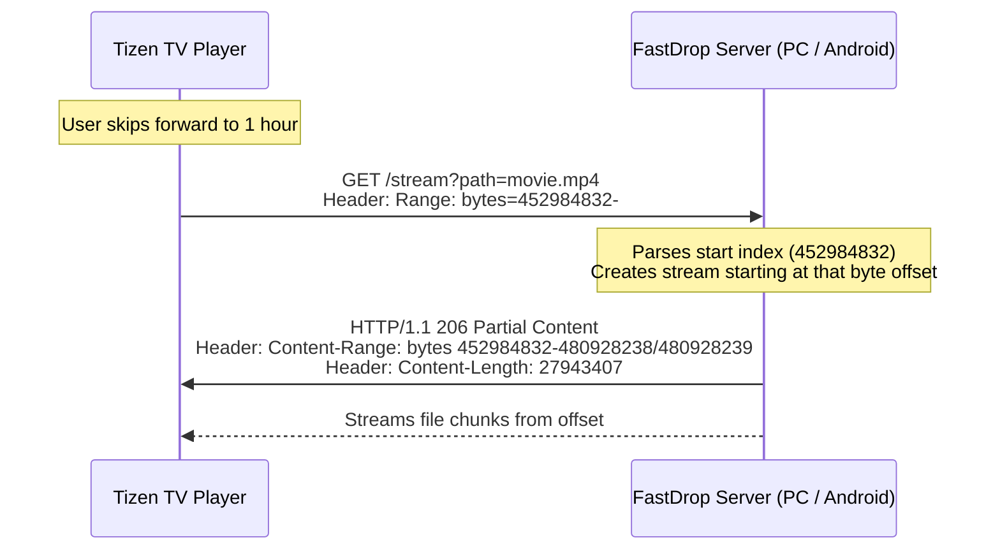

# FastDrop TV — User Guide & Setup Walkthrough

FastDrop TV is a high-speed local network file streaming application built specifically for Samsung Tizen TVs. It lets you stream videos, music, and images directly to your TV screen over your local network using either:
1. **Your Laptop/PC** (Node.js backend)
2. **Your Android Phone** (Native Android backend running with screen off via hotspot)

---

## 📂 Code Repository Structure

The complete project has been generated in your workspace at `c:\Users\Varshan\Downloads\projects\tieen\fastdrop-tv\`.

```text
fastdrop-tv/
├── server/                  # PC/Laptop Server (Node.js)
│   ├── package.json
│   ├── config.json
│   └── server.js
├── android-server/          # Android Mobile Server (Kotlin + Gradle)
│   ├── settings.gradle
│   ├── build.gradle
│   └── app/
│       ├── build.gradle
│       └── src/main/
│           ├── AndroidManifest.xml
│           ├── res/         # Layout & dark themes
│           └── java/com/fastdrop/server/   # Native server & foreground service code
└── tizen-tv-app/            # Samsung TV Client (HTML/CSS/JS)
    ├── config.xml
    ├── index.html
    ├── css/
    │   └── style.css
    └── js/
        ├── app.js
        └── lib/             # Bundled libraries (PDF.js)
```

---

## 📱 Option A: Setup Android Mobile Server (Zero Laptop Needed!)

This is your preferred setup: turning on your phone's hotspot, connecting your TV to it, starting the server, and turning your phone's screen off while the movie plays.

### 1. Build and Install the Android App
1. Download and open **Android Studio** on your computer.
2. Select **Open** and browse to the Android server folder: `c:\Users\Varshan\Downloads\projects\tieen\fastdrop-tv\android-server`.
3. Wait for Android Studio to sync the Gradle build files.
4. Enable **Developer Options** and **USB Debugging** on your Android phone.
5. Plug your phone into your computer via a USB cable.
6. Click the green **Run** button (or press `Shift + F10`) in Android Studio to build and install the app on your phone.

### 2. Configure Hotspot & Stream
1. On your phone, turn on your **Mobile Hotspot**.
2. Turn on your Samsung Tizen TV, open the network settings, and connect the TV to your phone's hotspot Wi-Fi.
3. Open the **FastDrop Server** app on your phone.
4. Tap **Start Server**.
5. The app will prompt you to grant **All Files Access** (Storage permission) so it can scan your movies. Grant it.
6. The app will display your hotspot server URL, which is usually **`http://192.168.43.1:8080`**.
7. Open your FastDrop TV app (see Tizen installation steps below), enter `192.168.43.1` (port `8080`), and click **Connect**.
8. **Turn your phone's screen off!** The app uses an Android Foreground Service, CPU WakeLock, and Wi-Fi lock to ensure the stream is never interrupted even when the phone is locked.

---

## 💻 Option B: Setup Windows PC/Laptop Server

### Prerequisites
Make sure **Node.js** (v14 or higher) is installed on your laptop/PC. If not, download and install it from [nodejs.org](https://nodejs.org/).

### 1. Configure Shared Directory
Open [server/config.json](file:///c:/Users/Varshan/Downloads/projects/tieen/fastdrop-tv/server/config.json) and set the path of the folder you want to share. Use double-backslashes `\\` for path separators in Windows:
```json
{
  "sharedFolder": "C:\\Users\\Varshan\\Videos",
  "port": 8080
}
```

### 2. Run the Server
Open your terminal (PowerShell or Command Prompt) and run:
```powershell
cd c:\Users\Varshan\Downloads\projects\tieen\fastdrop-tv\server
npm start
```
The console will boot up and print the local IP address (e.g. `http://192.168.1.8:8080`) to enter on your TV.

---

## 📺 Step 2: Deploying & Running Tizen TV Client

You can run the client app on your Samsung TV in two ways:

### Method A: Direct TV Browser (Simplest - No Studio installation needed)
1. Open the built-in **Web Browser** application on your Samsung TV.
2. Type the TV Browser URL shown in your server console (for PC: `http://YOUR_LAPTOP_IP:8080/client/index.html` or for Android: `http://192.168.43.1:8080/client/index.html`).
3. Enter the IP address on the connection screen and click **Connect**.
4. Bookmark the page on your TV Browser for easy 1-click access!

### Method B: Sideloading using Samsung Tizen Studio (Native App Installation)
To install the application permanently on the TV as a native widget:

1. **Install Tizen Studio**:
   - Download and install **Tizen Studio with CLI Tools** from the [Samsung Developer Website](https://developer.samsung.com/smarttv/develop/tools/tizen-studio.html).
2. **Enable TV Developer Mode**:
   - On your Samsung TV, go to the **Smart Hub / Apps** panel.
   - Using your remote control, press the numeric buttons `1`, `2`, `3`, `4`, `5` sequentially.
   - Toggle Developer Mode to **On** and enter your phone's hotspot IP (e.g. `192.168.43.1`) or laptop IP.
   - Restart the TV (hold down remote power button until the Samsung TV logo appears).
3. **Import Project to Tizen Studio**:
   - Open Tizen Studio.
   - Go to **File -> Import -> Tizen -> Tizen Project** -> Next.
   - Choose **Select root directory** and browse to: `c:\Users\Varshan\Downloads\projects\tieen\fastdrop-tv\tizen-tv-app`.
   - Click Finish.
4. **Connect TV to Tizen Studio**:
   - Open the **Device Manager** (Tools -> Device Manager).
   - Scan for devices, find your TV, and toggle the connection switch to **ON**.
5. **Build and Run**:
   - Right-click the project folder in Tizen Studio.
   - Select **Run As -> 1 Tizen Web Application**.
   - The project will build, compile, package into a `.wgt` file, and install directly on your TV.

---

## ✨ Premium Gold Glassmorphic Theme & Aesthetics

FastDrop TV has been redesigned with a state-of-the-art **Gold Glassmorphic Theme**:
* **Gold Highlights**: The UI uses pure gold (`#d4af37`) for active accents, icons, loaders, progress bars, and focused elements.
* **Warm Ambient Lighting**: Ambient backglows cast a warm golden-orange hue onto a dark charcoal slate background.
* **Glassmorphic Cards**: Content panels and dialog overlays use heavy backdrop-blur filters (`25px`) with thin gold borders for a sleek glass-like feel.
* **Fullscreen Browser Mode**: A dedicated **Fullscreen** button on the home card lets you toggle full screen in TV browsers to hide the address bar/URL menus.
* **Auto-Fullscreen Playback**: Starting any video automatically triggers fullscreen mode for a seamless, theater-like experience.
* **Premium Vector Icons**: All basic emoji icons across the connection page, empty states, folder browsers, playback OSD settings, audio players, and warning notification toasts have been replaced with clean inline SVG vector graphics that render beautifully on large 4K Smart TV screens.

---

## ⚡ Welcome Screen & Splash Loader

On app launch, a custom **Splash Screen** is shown:
* Displays the glowing golden **FastDrop TV** logo.
* Features the text **"Developed by Varshan"** in a premium metallic spacing.
* Displays a warm **glowing gold progress loader** that auto-fills over 2.5 seconds before transitioning into the main app.

---

## 🖼️ Custom Android App Icon

The Android server app includes a custom-designed launcher icon:
* Encloses a glowing golden 3D lightning bolt within a gold-bordered rounded rectangle glass plate.
* Registered in the `AndroidManifest.xml` under `@mipmap/ic_launcher` and `@mipmap/ic_launcher_round`.

---

## ⌨️ Remote Controls & Spatial Navigation

The TV client has been built with full TV remote control support:
* **Arrow Keys**: Move focus smoothly between files and buttons. The active element will show a glowing **gold** border.
* **Enter**: Select folder, play media, or pause/resume playback.
* **Left/Right Keys**: While playing media, skip backward/forward by **10 seconds**.
* **Backspace / Tizen Return key (10009)**: Goes back. If you are watching a movie or viewing a picture, pressing Back closes the player and returns you safely to the file explorer.
* **Scroll Alignment**: The file browser automatically scrolls up or down to keep the focused item visible on the screen.

---

## ⏳ Subtitles & Resume Playback Features

* **Real-time Subtitles**: If a `.srt` or `.vtt` file exists alongside a video file, it is automatically detected. The player loads it, and the backend converts SRT to WebVTT on-the-fly.
* **Continue Watching**: Playback progress is saved every 5 seconds. If you exit a video and reopen it later, a glassmorphic dialog prompts you to **Resume** from where you left off or **Start Over**.

---

## 🚀 How HTTP Range Requests Work (Seeking & Fast Forwarding)

When playing large files (like 15GB movies), loading the full file is impossible. Instead, the TV player requests specific parts of the file as you watch or seek.

Both our **Node.js Server** and **Android Kotlin Server** implement full HTTP Range parameters:



- When the TV requests a video file, it sends a `Range: bytes=start-end` header.
- The server responds with **`206 Partial Content`**.
- It returns only the requested block of bytes using a buffered file stream rather than reading the entire file into memory. This is highly efficient and easily supports streaming files over 15GB without network bottlenecks.

---

## 🎬 Completed Phase 4 Premium Features

We have successfully implemented and verified all next-level features of Phase 4:

### 1. 🎬 Offline Movie Posters (Zero Cloud Metadata Required)
* **How it works**: The server (both Node.js and Android Kotlin implementations) does a first-pass scan in the shared media folder. If it finds a video file (e.g. `Inception.mp4`) and a matching image file (e.g. `Inception.jpg`, `Inception.jpeg`, or `Inception.png`), it associates the image as a `posterPath` property on the video object.
* **Tidy Folder Listings**: The raw image files used as poster covers are hidden from the file explorer grid to keep folder listings tidy.
* **Premium Grid Cards**: The Tizen client displays the actual movie poster art inside the grid item card rather than the generic movie emoji.

### 2. 🎚️ Subtitle Style Settings (OSD Customizer)
* **How it works**: When playing a video with subtitles, you can customize the styling directly on the TV:
  * **Subtitle Sizes**: Cycle through **Small** (20px), **Medium** (28px), and **Large** (38px).
  * **Subtitle Colors**: Cycle through **White** (`#ffffff`), **Yellow** (`#ffca28`), and **Cyan** (`#00e5ff`).
* **Instant Refresh**: Changing styles dynamically updates the HTML5 video subtitle tracks via CSS `::cue` target selectors.

### 3. 🔒 TV Remote Focus Trapping & OSD Lock
* **Focus Entry**: Pressing the **UP** arrow on the remote control during video playback reveals the OSD and transfers focus to the subtitle settings buttons.
* **Navigation Lock**: While settings are focused, left/right remote arrow keys shift focus between buttons, and the Enter key cycles settings values.
* **Focus Exit**: Pressing the **DOWN** arrow or **BACK** key exits the settings focus trap, hides the OSD settings focus, and returns remote arrow keys to standard timeline seeking/scrubbing.

### 4. 🖼️ Family Photo Slideshow Mode
* **How it works**: Pressing **ENTER** or the play/pause button while viewing a photo starts an automatic slideshow.
* **Autoplay**: The player automatically transitions to the next photo in the current folder every 5 seconds.
* **Indicator**: A glowing glassmorphic pill displays "📸 Slideshow Active" on the screen.

### 5. 🔀 Music Playlists Auto-Play
* **How it works**: When streaming music, the player maintains an active playlist of all audio tracks in the folder.
* **Auto-Next**: When a song finishes, the app immediately plays the next audio track in the folder automatically.

---

## 💎 Completed Phase 5 Premium Features

We have successfully implemented and verified all premium audio and PDF features:

### 1. 🎵 Music Background Playback & Floating Mini-Player
* **How it works**: Exiting the audio screen keeps the track playing. The app displays a beautiful, floating gold glassmorphic mini-player bar at the bottom-right of the browser screen with a progress fill indicator.
* **Return/Maximize**: Pressing **BACK** while minimized seamlessly maximizes the audio player to its full-screen view.

### 2. 🔀 Shuffle & Repeat Playback Modes
* **Cycle & Shuffle**: Added dedicated buttons on the Audio Screen, allowing you to toggle Shuffle mode and cycle Repeat configurations (Repeat One, Repeat All, Repeat Off). The app automatically manages playlist queue progression based on these states.

### 3. 📄 High-Performance Offline PDF Viewer
* **Lag-Free Rendering**: Renders PDF documents directly inside the media grid. PDF.js is fully bundled locally for 100% offline usage.
* **Memory Management**: To prevent browser lag or crashes on memory-constrained TV browsers, pages are rendered one-at-a-time onto an HTML5 `<canvas>` element with strict garbage collection (`page.cleanup()`) on page transitions. Page navigation is handled simply with remote Left/Right arrow keys.

### 4. 🗂️ Media Category Sorting & Filter Bar
* **Instant Sorting**: Added a filter bar at the top of the file browser grid containing: **All**, **Videos**, **Audio**, **Images**, and **PDFs**.
* **Clean Navigation**: Selecting any category instantly sorts/filters the grid to display only matching media files along with directories. Folders are kept visible so you can navigate folders while a filter is active.
* **Tizen Focus Integration**: Seamlessly integrated into the 5-column layout for TV remote navigation.

---

## 📱 Completed Phase 6 Phone-to-TV Video Casting & Remote Control

We have successfully implemented the local network video casting and remote controller dashboard.

### 1. 📱 App Mode Toggles
* **Receiver Mode (TV)**: Configures the client to act as a playback target. It runs a background polling loop checking the server's cast state every 1.5s. If a new cast command is received, it auto-plays the video, pauses/resumes, seeks, or switches audio tracks.
* **Remote Mode (Phone)**: Configures the client to act as a remote controller. Selecting a video on the phone initiates the cast on the TV browser and redirects the phone to the glassmorphic remote dashboard overlay.

### 2. 📡 HTTP Casting Broker API
Endpoints implemented on both the **Node.js Server** and the **Android Native Kotlin Server**:
* `/api/cast/play?path=...`: Initiates casting for a video path.
* `/api/cast/control?command=play|pause|stop`: Sends basic playback control commands.
* `/api/cast/seek?time=...`: Seeks the TV player to a specific timestamp in seconds.
* `/api/cast/change-audio?index=...`: Switches the enabled audio track language on the TV video player.
* `/api/cast/report?...`: Receives real-time state from the TV receiver (elapsed time, total duration, playing state, active audio track).
* `/api/cast/status`: Serves the aggregated state to controllers.

### 3. 🎛️ Glassmorphic Remote Dashboard
A premium gold glassmorphic dashboard overlay (`#remote-screen`) displayed on the phone:
* **Active Metadata**: Shows the casting media name and connection status.
* **Play/Pause Toggle**: Updates its icon dynamically based on the receiver's state.
* **Progress Slider Timeline**: Syncs real-time with TV status and allows touch/drag seeking (scrubbing) back and forth.
* **Audio Track Switcher**: Dynamically lists and enables toggling of multi-language audio tracks.
* **Disconnect / Stop Casting**: Instantly stops the remote cast and returns both devices to the file browser grid.

### 4. 🛠️ Hotfix: Dynamic IP Routing & Special Characters Decoding
* **Dynamic IP Extra**: Resolved loopback connection issues by retrieving the phone's actual WLAN/Hotspot IP address in [MainActivity.kt](file:///c:/Users/Varshan/Downloads/projects/tieen/fastdrop-tv/android-server/app/src/main/java/com/fastdrop/server/MainActivity.kt) and passing it to [RemoteActivity.kt](file:///c:/Users/Varshan/Downloads/projects/tieen/fastdrop-tv/android-server/app/src/main/java/com/fastdrop/server/RemoteActivity.kt) via Intent extra. This replaces the hardcoded `127.0.0.1` and displays the correct server IP (e.g. `192.168.43.1`) in the TV receiver pill.
* **Robust Query Decoding**: Updated [LocalHttpServer.kt](file:///c:/Users/Varshan/Downloads/projects/tieen/fastdrop-tv/android-server/app/src/main/java/com/fastdrop/server/LocalHttpServer.kt) to split query parameters on the raw encoded URI string, decoding individual parameters afterwards. This prevents filenames containing special characters like `&` or `=` from being truncated during playback and casting.

---

## 🔮 Future Roadmap: Next-Level Features

* **🌐 Subtitle casting support**: Enable casting and custom styling of subtitles from the remote screen.

